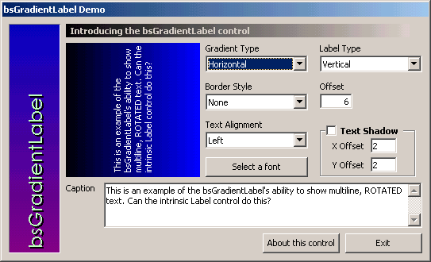



## bsGradientLabel version 3

### Description

This is version 3 of my bsGradientLabel, and I've given in. It now supports multiline text, both horizontally and vertically. Check it out! It's a 63 kb download.
 
### More Info
 

             |
---                |---
**Submitted On**   |2002-04-24 11:42:56
**By**             |[Headdy](https://github.com/Planet-Source-Code/PSCIndex/blob/master/ByAuthor/headdy.md)
**Level**          |Advanced
**User Rating**    |4.6 (41 globes from 9 users)
**Compatibility**  |VB 5\.0, VB 6\.0
**Category**       |[Custom Controls/ Forms/  Menus](https://github.com/Planet-Source-Code/PSCIndex/blob/master/ByCategory/custom-controls-forms-menus__1-4.md)
**World**          |[Visual Basic](https://github.com/Planet-Source-Code/PSCIndex/blob/master/ByWorld/visual-basic.md)
**Archive File**   |[bsGradient752794242002\.zip](https://github.com/Planet-Source-Code/headdy-bsgradientlabel-version-3__1-34088/archive/master.zip)

